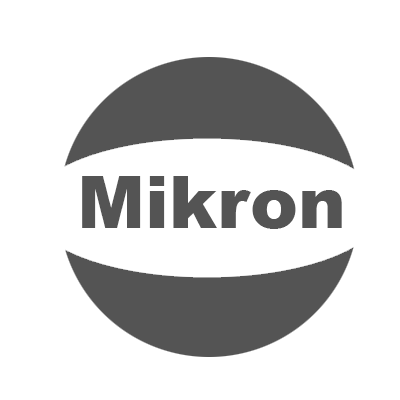

<p align="center">
    
</p>

<div align="center">

[](https://opensource.org/licenses/Apache-2.0)
[](https://opensource.org/licenses/Apache-2.0)
[](https://github.com/reevik/darkest/wiki/Java-Support)
[](https://central.sonatype.com/artifact/net.reevik/darkest)
[](https://reevik.github.io/mikron/)
</div>

Mikron is a minimalistic web-free IoC container for dependency injection and externalized configuration management for Java. To use the Maven-based project, you can add the following dependency:

```xml

<dependency>
  <groupId>net.reevik</groupId>
  <artifactId>mikron</artifactId>
  <version>${latest}</version>
</dependency>
```

## Usage

You will use Mikron annotations to initialize the Mikron context in your Java application. In the following example, we declare a "Mikron Application" by using `@ManagedApplication` annotation, and instantiate the Mikron context. MikronContext is the implementation of IoC container, where managed instances reside:

```java
@ManagedApplication(packages = {"your.package.to.scan"})
public class Main {

  public static void main(String[] args) {
    Optional<AnnotatedManagedClass> instance;
    try (MikronContext context = MikronContext.init(MikronContextTest.class)) {
      instance = context.getInstance(AnnotatedManagedClass.class.getName());
    } catch (Exception e) {
      throw new RuntimeException(e);
    }
  }
}
```

Mikron context is the container where the managed instances reside and the dependencies between managed objects get wired. You will use `@Managed` annotation to declare managed instances:

```java
@Managed
public class ManagedObject {

  @Configurable(name = "config.temp")
  private Integer temperature;

  @Wire
  private ManagedDependency managedDependency;
}
```

and the `@Wire` annotation introduces dependency injection point whereas `@Configurable` annotation is used to inject externalized configurations. 

## Documentation

You can check out the [Mikron Wiki](https://github.com/reevik/mikron/wiki) for the documentation and [API Docs](https://reevik.github.io/mikron/).

## Bugs and Feedback

For bugs, questions and discussions please use
the [GitHub Issues](https://github.com/notingolmo/mikron/issues).

## LICENSE

Copyright 2024 Erhan Bagdemir

Licensed under the Apache License, Version 2.0 (the "License");
you may not use this file except in compliance with the License.
You may obtain a copy of the License at

http://www.apache.org/licenses/LICENSE-2.0

Unless required by applicable law or agreed to in writing, software
distributed under the License is distributed on an "AS IS" BASIS,
WITHOUT WARRANTIES OR CONDITIONS OF ANY KIND, either express or implied.
See the License for the specific language governing permissions and
limitations under the License.

[license]:LICENSE-2.0.txt
[license img]:https://img.shields.io/badge/License-Apache%202-blue.svg
